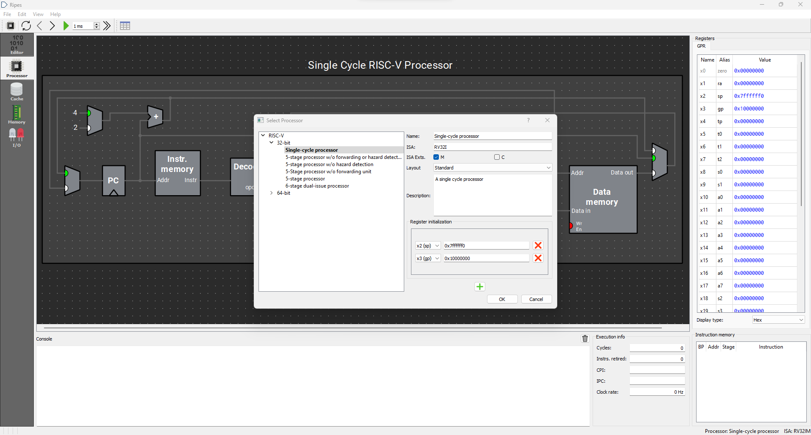
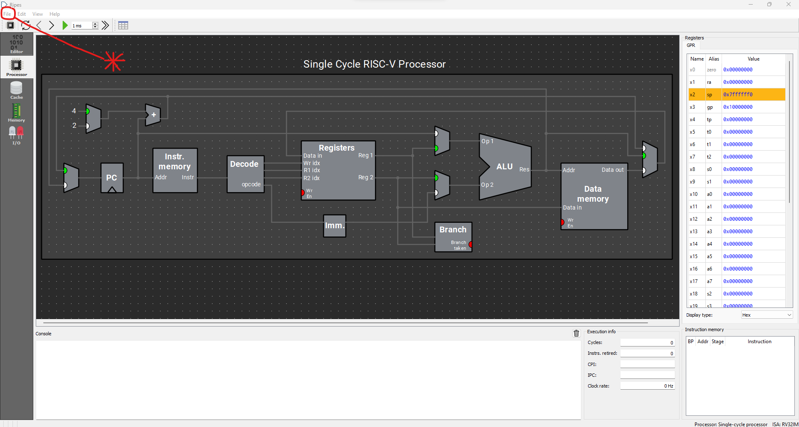
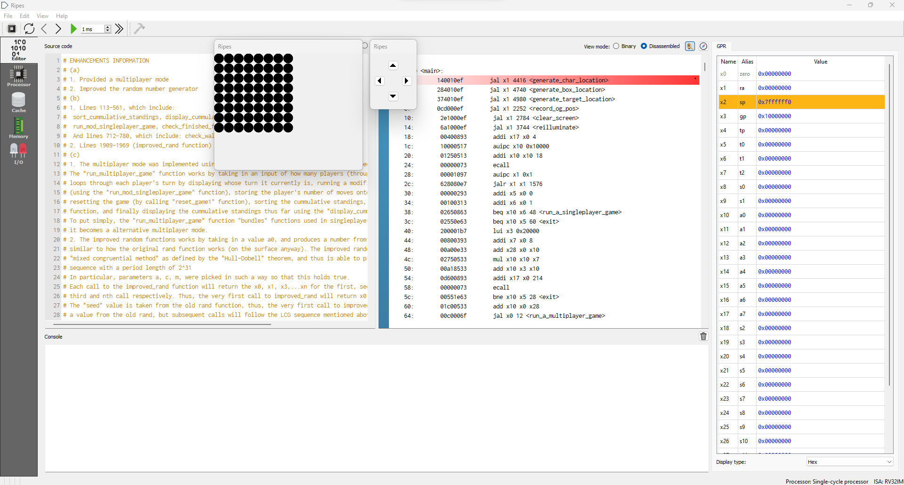
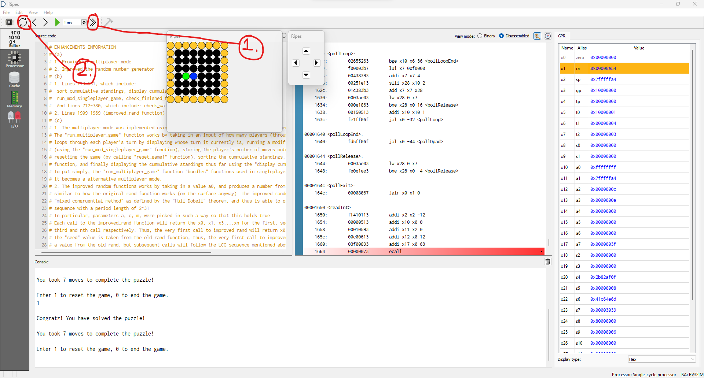
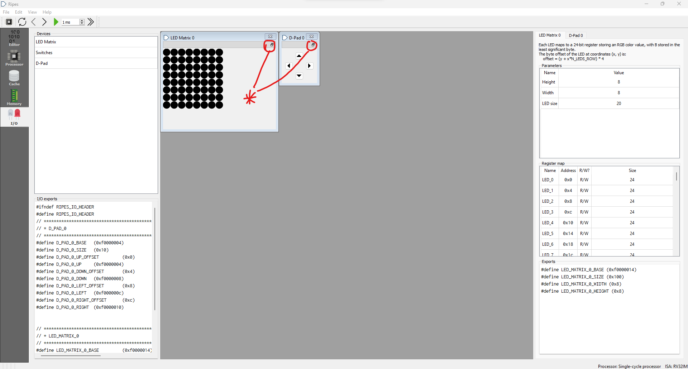
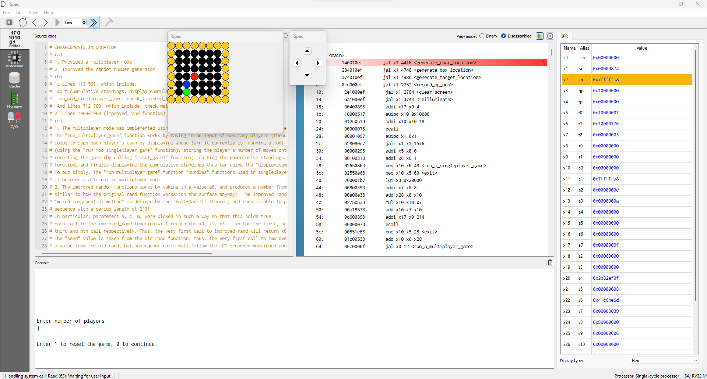
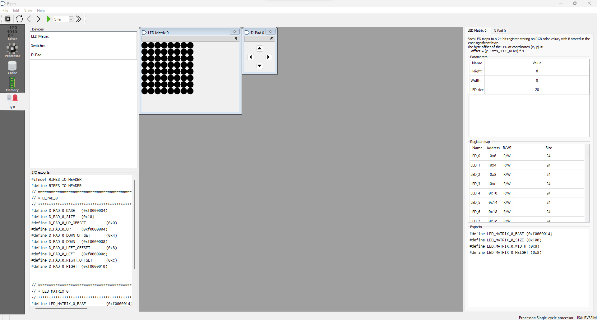
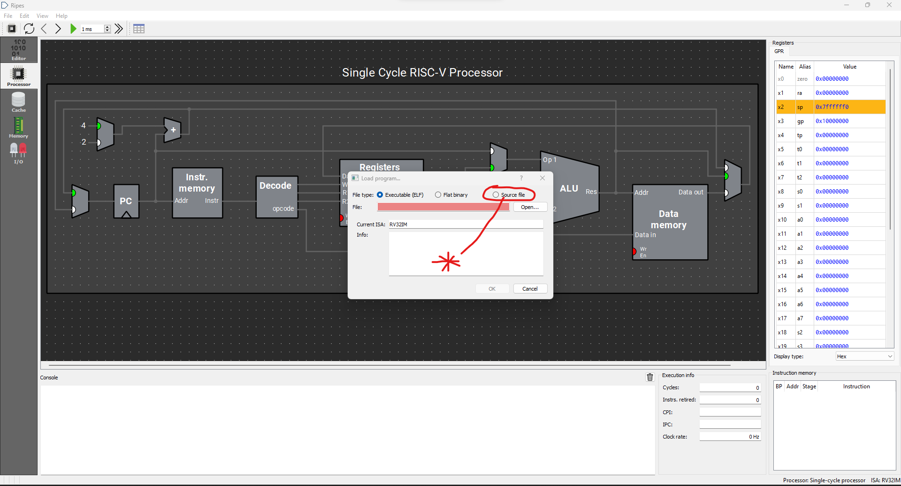
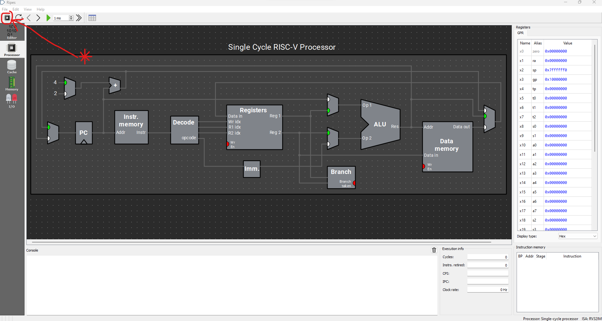

<h1>Sokoban Instruction Manual</h1>

<h2>Sections (1-3)</h2>

1. **What is Sokoban?**
* Brief Introduction
2. **Playing the Game:**
* Setting up Ripes
* How to Play
* Resetting the Game
* Winning the Game
3. **Troubleshooting**
* Common Errors and What to Do

<h1>1. What is Sokoban?</h1>

**Brief Introduction:**

Sokoban is a puzzle game that involves a player, box, walls, and a “target location.” The goal of the game, as a player, is to move the box onto the “target location” in as few moves as possible.

<h1>2. Playing the Game</h1>

<h2>Setting up Ripes:</h2>
1. Find the installation folder for Ripes.
2. Open Ripes by double-clicking the executable file named “Ripes.exe.”
3. In the top-left hand corner there should be a CPU-like icon:

Click on it to open up the following settings menu:

Select the “Single-cycle processor” under the “RISC-V 32-bit” modules, then press “OK.”

4. Click on the “File” button in the top-left corner, and select “Load Program.”

5. The following screen should pop-up:

Now select the “Source file” button and paste the location of the “sokoban.s” file, and press “OK.” Alternatively, the “sokoban.s” file may also be selected using the “Open…” button.

6. On the left-sidebar click on the “I/O” button. The following screen should pop-up:

If the LED Matrix or D-Pad are not present, double-click their respective buttons on the left under the “Devices” tab to open them. Then, on the right select “Led Matrix” and specify a height of 8, width of 8, and LED size to whatever is preferred.

7. Now in the top-right corner of the LED Matrix and D-Pad, there should be a “double windows-looking” icon.

8. Click on it, and then select the “Editor” button on the left sidebar. The screen should now look like this:

9. Finally, in the top-left corner, select the double right-pointing arrows (>>) to run the game.

<h2>How to Play</h2>

Before you begin playing the game, here are the game rules.

**_Rules of the Game:_**

1. The player can only move horizontally or vertically.
2. The player cannot walk through walls or boxes.
3. The player can walk over the target location marker.
4. The player can only push the box in the same direction to which they are walking. 
* **Ex:** If the player is walking to the right, the box will be pushed to the right.
5. The box cannot be pushed through walls.
6. The player cannot pull the box.

Once the double right-pointing arrows (>>) in _step 9_ of _Setting up Ripes_ is selected, the screen should look like this:

Note the following colour-codings are used:

1. **Player** = Green
2. **Walls** = Yellow
3. **Box** = Dark-Blue
4. **Target Location** = Red

Also note that the locations for the player, box, and target location, are randomly determined on start-up.

**Selecting Singleplayer/Multiplayer Modes:**

In the bottom box labelled “Console” it is possible to select the line right below “Enter number of players” and to type in the number of players. Make sure to hit enter once a number is provided.

**_Singleplayer mode_** will be activated if the number of players specified is exactly one, while **_multiplayer_** mode will be activated if the number of players specified is greater than one.

Note that in **_multiplayer_** mode, the current player's turn will be indicated in the “Console.”

**How to Move/Interact:**

To move up, down, left, or right, use the D-Pad controls by selecting the corresponding up, down, left, or right arrows. Note that this can only be done once the singleplayer or multiplayer mode is selected. 

Note that invalid movements will not be executed. For instance, if the player attempts to walk through a wall, the game will not execute that action since it is against the game rules. 

<h2>Resetting the Game:</h2>

In **_singleplayer mode_**, the player may request to reset the game by attempting to walk through any wall 3 consecutive times. The following prompt will then be displayed in the console:

In this case, resetting the game will not randomise the starting player, box, or target locations, but rather restore the initial start-up locations of the player, box and target instead.

In **_multiplayer mode_**, resetting the game will be similar to singleplayer mode, however, the number of moves for the current player will not be reset. 

For instance, if player 2, in a multiplayer game, gets stuck after making 5 moves and then decides to reset, after which, player 2 solves the puzzle in 7 moves, their total moves will be 12 instead of only 7. 

<h2>Winning the Game:</h2>

In **_singleplayer mode_**, a victory message will be displayed after the player completes the puzzle, alongside the number of moves they took to solve the puzzle. An option to reset the puzzle or end the game will be given in the console afterwards.

In **_multiplayer mode_**, a victory message will be displayed after the current player completes the puzzle. Then, the sorted cumulative scores for all players who already finished their turn will be displayed in the console.

In this case, cumulative scores will be sorted from least number of moves required to complete the puzzle to greatest. Ties are broken according to the player number, where the smaller player number is displayed first.

For instance, if player 1 and player 5 both have the same number of moves, player 1 will be displayed first.

<h1>3. Troubleshooting</h1>

<h2>Common Issues and Solutions</h2>

**Problem 1: Ripes Crashed**

_Solution:_

Follow steps 1-2, 4-9 in **section 2’s** _Setting up Ripes_ subsection to restart Ripes and reload the game.

**Problem 2: Restarting the Game without Restarting Ripes**

_Solution:_

Make sure the double right arrow (>>) icon in the top-left of the screen is deselected, then select the “recycle icon” also in the top-left. Finally, reselect the double right arrow icon (>>) again. 

See the image below for additional guidance:

**Problem 3: Error Code 1**

_Solution:_

This is most likely caused by inputting a negative number of players on game startup. Follow the solution provided in **Problem 2**, to restart the game without having to restart Ripes again. 

<h1>Additional Notes</h1>

This was written using the RISC-V instruction set architecture.
